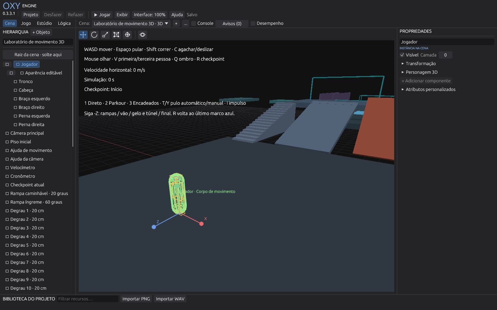

# OXY Engine

Editor e runtime de jogos desktop escritos em Rust, sem outra engine como núcleo. Um mesmo projeto reúne cenas 2D/3D, modelagem por peças e polígonos, pintura de texturas PNG, animação rígida, física de personagem e lógica visual por nós. O editor e o player compartilham egui/eframe 0.33.3 e wgpu 27.0.1.



**Versão atual: 0.4.0.** Veja as novidades no [CHANGELOG](CHANGELOG.md) e o uso detalhado no [guia do editor](docs/guia-do-editor.md).

## O que ela faz

- **Cenas 2D e 3D** com hierarquia, grupos, câmeras, interface de jogo (texto, imagem, botão, barra) e importação de PNG/WAV.
- **Modelagem** de primitivas paramétricas e malhas poligonais: extrusão, borda interna, corte em loop, bisturi, arredondamento e encaixe.
- **Pintura** direto na imagem ou na superfície da peça, com atlas UV que preserva os pixels após cortes.
- **Animação** rígida por peças, com timeline, quadros-chave e eventos.
- **Lógica visual** por nós, com ações de entrada e um guia offline com doze receitas prontas.
- **Personagem 3D** com corpo de movimento configurável, câmeras em primeira/terceira pessoa e um laboratório de movimento editável.
- **Player separado** (`oxy_player.exe`) para distribuir só o jogo, sem o editor.

## Baixar e abrir

Requisitos: Windows 10/11 x64, driver gráfico atualizado e GPU compatível com DirectX 12 ou Vulkan.

1. Baixe o ZIP da [última Release](https://github.com/Ratcicle/OXY-Engine/releases/latest) e extraia tudo em uma pasta gravável.
2. Abra **`OXY Engine.exe`**. Mantenha a pasta `data` e as DLLs junto dos executáveis.
3. Na tela inicial, escolha **Novo projeto**, **Abrir projeto**, **Projeto de exemplo** ou **Laboratório 3D · movimento**.

Os exemplos abrem como cópias seguras. Projetos recentes e preferências ficam em `%LOCALAPPDATA%/OXY Engine`, fora do projeto.

## Compilar

Instale Rust **1.92.0** com rustfmt e Clippy, e as ferramentas C++/Windows SDK para MSVC (ou MinGW-w64 completo). Na raiz do repositório:

```powershell
cargo run --locked -p oxy_editor
cargo run --locked -p oxy_editor -- examples/validacao/project.oxy.json
cargo run --locked -p oxy_player -- examples/validacao/project.oxy.json
cargo build --workspace --release --locked
```

Nesta máquina, `scripts/cargo.ps1` configura o compilador GNU preparado; passe os argumentos como vetor:

```powershell
./scripts/cargo.ps1 @('run','--locked','-p','oxy_editor','--','examples/validacao/project.oxy.json')
```

## Estrutura

| Crate | Papel |
|---|---|
| `oxy_core` | Documentos, persistência, migração, geometria, física, runtime e grafo de lógica. Sem GPU nem interface. |
| `oxy_render` | Renderer wgpu, seleção, interface de jogo e tema visual compartilhado. |
| `oxy_editor` | O editor (`OXY Engine.exe`). |
| `oxy_player` | O runtime dos jogos (`oxy_player.exe`). |

## Verificar e distribuir

```powershell
cargo fmt --all --check
cargo build --workspace --locked
cargo test --workspace --locked
cargo clippy --workspace --all-targets --locked -- -D warnings
# Testes nativos (Windows e GPU), um processo por teste. Capturas vão para target/qa/.
./scripts/test-native.ps1
# Engine portátil: editor + player + exemplos. -SkipBuild reutiliza o release já compilado.
./scripts/package-engine.ps1
./scripts/test-portable.ps1 -Zip './dist/OXY-Engine-0.4.0-windows-x64.zip'
# Exportar um jogo: só runtime e dados, sem depender do editor.
./scripts/package.ps1 -Project 'examples/validacao' -Destination 'dist/Meu-Jogo'
```

Os testes nativos e as medições gravam capturas e relatórios em `target/qa/` (ou na pasta de `OXY_QA_DIR`). Benchmarks e comparações estão descritos em [`benchmarks/README.md`](benchmarks/README.md).

O CI (`ci.yml`) verifica formatação, build, testes e Clippy. `portable-windows.yml` gera o ZIP x64 com SHA-256: artifact em pushes para `main` e anexo de Release em tags `v*` que correspondem à versão do workspace. Não há instalador, atualizador automático ou assinatura digital.

## Compatibilidade

O formato atual dos projetos é **schema_version 4**. Documentos de versões anteriores são migrados em memória sem mudar IDs; ao salvar, um backup dos bytes originais é criado. Versões futuras ou inválidas são recusadas. Os limites de cada ferramenta estão no [guia do editor](docs/guia-do-editor.md#compatibilidade-e-domínio-suportado).

## Licença

[MIT](LICENSE). As licenças de terceiros estão em [`licenses/`](licenses/).
